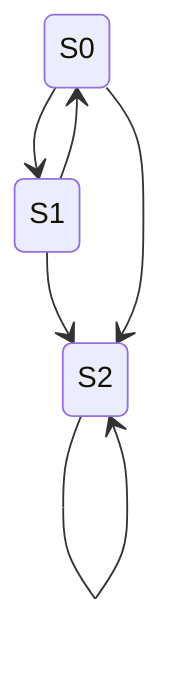
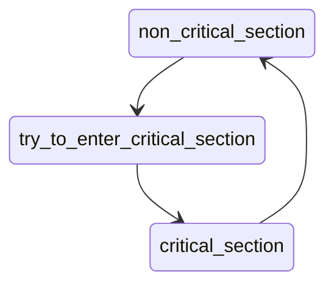
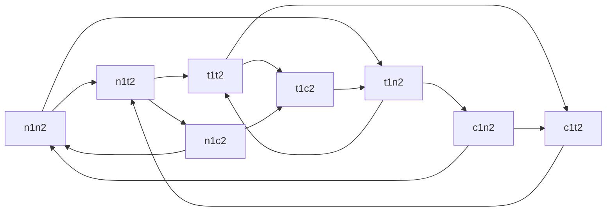
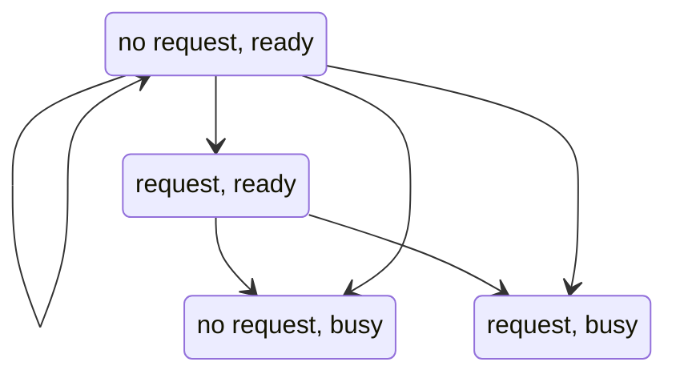
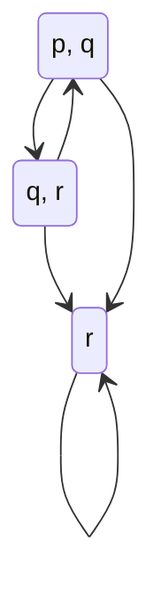
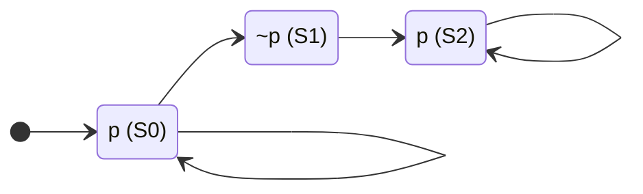

# Foundations of automatic verification

## Intro lecture 

Predicate / propositional logic

Model checking
* Automata on infinite words (Buchi automata)
* Binary decision diagrams 
* SAT solving 
	* DPLL, CDCL
* Abstraction refinement
	* Predicate abstraction
	* Counter-example guided abstraction refinement

Verifying programs
* Invariants
* Interpolents
* Ranking functions
* Hoare logic

Advanced topics:
* Timed automata: Automata with clocks. Model real time behavior of systems.
* Verification of deep neural networks

### Logic flavors
Careful balance between 
* how complex systems can be specified
* automatically argue about the correctness, etc

#### Propositional logic
> If the train arrives late and there are no taxis at the station, then John is
late for his meeting. John is not late for his meeting. The train did arrive
late. Therefore,there were taxis at the station.
>
> p: train arrives late 
>
> q: there are taxis at the station
>
> r: John is late
>
> If p and not q then r. Not r. p. Then q.

**Syntax of propositional logic**

* Unbounded supply of atoms (atomic propositions)

$\phi := p | \lnot \phi | \phi \land \psi | \phi \lor \psi | \phi \rightarrow \psi$
where `p` is an atom

This is called the BNF form.

Syntax now allows us to write formulas. But we also need to give meaning to formulas.

**Semantics of propositional logic**
Atoms and formulas take values: either true or false.

$p$ | $\lnot p$
----|----------
T | F
F | T

Similarly for others. Defined semantics using truth tables. Using truth tables
we can figure out if complex formulas are true or not.
$(p \rightarrow \lnot q) \rightarrow (q \lor \lnot p)$

* *Satisifiability*: If there is some assignment of atoms such that the formula can
be true.
* *Validity*: If the formula is true for every assignment of atoms.

$(p \lor q) \rightarrow p$ is satisfiable but not valid.

$\phi$ is satisfiable iff $\lnot \phi$ is valid.

Normal forms
* Conjunctive normal form (CNF)
* Disjunctive normal form (DNF)
* Negation normal form (NNF)

Which of these forms make it easier to answer satisfiability? To answer
validity?

#### Predicate logic 

We don't want to treat every declarative statement as an atomic proposition.

Statement: Every student is younger than some instructor. 

We would like to deal with the finer structure of a declarative statement.
Predicates and quantifiers.

* S(x) : x is a student
* I(x) : x is an instructor
* Y(x, y): x is younger than y
* $\forall s: S(s) \rightarrow \exists i: I(i) \land Y(s, i)$

**Syntax**

Vocabulary:
* Predicate symbols  (arity)
* Constants 
* Function symbols (arity)

Terms:
* every variable and constant symbol 
* If $t_1, t_2, .., t_n$ are terms then $f(t_1, t_2, .., t_n)$ is a term

Formulas:

$\phi := t | P(t_1, .., t_k) | \lnot \phi | \phi \land \psi | \phi \lor \psi |
\phi \rightarrow \psi | \forall x: \phi | \exists x: \phi$ where $x$ is a
variable, $t, t_1, ... t_k$ are terms and $P$ is a k-ary predicate.

## Lecture 2

### Predicate logic semantics

Given a signature $\sigma$, we need $\sigma$ structure/assignment. 
* A non-empty universe over which $\sigma$ gets meaning $U_A$.  
* We have to define for which a predicate is true. k-ary predicate : $U_A * U_A ... * U_A$
* Every k-ary function : $U_A * U_A ... * U_A \rightarrow U_A$
* Constant $c \in U_A$
* Variables $v \in U_A$

**Satisfaction relation**
$A$ is an assignment, $F$ is a formula:
$A \models F$

Given an assignment, every term can be evaluated $A[\![t_1\!]]$, $A[\![t_2\!]]$,
.. $A[\![t_n\!]]$. It becomes easy to know if formula is satisfied.

Universe is non-empty but it can be infinite. $\forall$ and $\exists$ become
difficult. How to find an assignment?

**Semantic entailment**:
$\phi_1, \phi_2, ..., \phi_n \models \psi$
When LHS is true, RHS should be true. Semantic entailment is difficult. We have
to argue about every assignment. Easier in propositional logic since assignments
can be enumerated (just true or false).

$\forall x (P(x) \rightarrow Q(x)) \models \forall x P(x) \rightarrow \forall x Q(x)$
holds.

$\forall x P(x) \rightarrow \forall x Q(x) \models \forall x (P(x) \rightarrow Q(x))$
does not hold.

This assignment is ok for LHS but not for RHS
* $P(x_0)$ is false, $Q(x_0)$ is true
* $P(x_1)$ is true, $Q(x_1)$ is false

Derivability $|-$ . They are part of the proof rules. Used by automated theorem
provers.  Derivability vs entailment?

### Model checking

Model the system. Does it satisfy the property? Computer can say here is why it
does not satisfy the property.

``` 
x = 0; y = 0;
while(*)		// * is a non-deterministic condition
	x++; y++;
while(x != 0 /\ y != 0)
	x--; y--;
assert(x = 0 /\ y = 0)
```

Assertion holds. At assertion, either x = 0 or y = 0. And x and y are always
equal.

Are we able to specify the system? Are we able to automatically verify its
properties?  What kind of properties are we not able to specify?

### Linear-time temporal logic (LTL)

We can just say that P holds true or Q holds true in predicate logic. We are not
able to talk about evolving systems. What happens in the future?

Concurrent processes trying to get a resources: 
* If access to resource is requested -> resource will be granted in future

$\phi := \top | \bot | p | \lnot\phi | \phi \land \psi | \phi \lor \psi | \phi \rightarrow \psi | X\phi | F\phi | G\phi | \phi U \psi$

* $\top$ and $\bot$ are just true/false
* X: next 
* F: future 
* G: globally
* U: until

$F(p\rightarrow Gr) \lor (\lnot q \cup p)$ is a valid formula.

* Unary primitives bind most tightly: $\lnot, X, F, G$
* U
* $\land, \lor$
* $\rightarrow$

**Parse tree**:

```
$\lor$
/ \
F  ...
|
$\rightarrow$
| \
p  G
   |
	 r
```

$\psi$ is a **subformula** of $\phi$ if the parse tree of $\psi$ is a subtree of
the parse tree of $\phi$.

#### LTL semantics
Interested in verifying transition systems. 
$M = (S, \rightarrow, L)$.
* $S$: Set of states
* $\rightarrow$: Set of transitions
* $L$: Labelling function 


Every state should have atleast one transition outside it.

Labelling function: what atomic propositions are true in each state. 
``` 
S0: p, q
S1: q, r
S2: r
```

> Predicates are not available in LTL (perhaps only approximated by labelling function?).

Path: infinite sequence of transitions through the system.  Example: $S0 -> S2 -> S2 -> ...$

Let $M$ by the system and $\pi$ is a path.

* $\pi \models \top$
* $\pi \not\models \top$
* $\pi \models p$ if the first state satisifies $p$ according to the labelling
  function, i.e, $p \in L(S0)$
* similar for $\lor$ etc
* $\pi \models X\phi$ if the second state satisifies $p$ according to the labelling
  function, i.e, $p \in L(S1)$, $\pi^2 \models \phi$
* $\pi \models F\phi$ if $\phi$ is true in some state in $\pi$. We assume future
  includes the current, i.e, the first state in the path.
* $\pi \models G\phi$ if $\phi$ is true in all states in $\pi$
* $\pi \models \phi U \psi$. At some point $\psi$ becomes true, until then
  $\phi$ must be true. It demands that $\psi$ is true at some point in the
  future. It does not demand that $\phi$ is false after that point.
	* I was happy until I got married does not imply that I must get unhappy after
	  I get married.

$M, S \models \phi$ iff for every path $\pi$ starting from S, we have $\pi \models \phi$.
Examples: 

* $M, S_0 \models p \land q$. True.
* $M, S_0 \models \lnot r$. True.
* $M, S_0 \models X r$. True.
* $M, S_0 \models X (q \land r)$. False. If $S_0$ goes next to $S_2$.
* $M, S_0 \models G (p \land \lnot r)$. True. p and r are never true together.
* $M, S_2 \models G r$. True. All paths starting from $S_2$ stay on $S_2$.
* $M, S_0 \models F (\lnot q \land r) \rightarrow FGr$. True. LHS is true only
  for paths that go to $S_2$. Once we go to $S_2$, RHS is true.
* $M, S_1 \models F (\lnot q \land r) \rightarrow FGr$. True. 
* $M, S_2 \models F (\lnot q \land r) \rightarrow FGr$. True. 
* $M, S_0 \models GFr \rightarrow GFp$. False. A path that loops infinitely over
  $S_2$ satisfies GFr but not GFp.
* $M, S_0 \models GFp \rightarrow GFr$. True. LHS imply that the path go through
  $S_0$ infinite times. RHS imply that the path go through either $S_1$ or $S_2$
  infinite times.

## Lecture 3

Subformulas of $p U (q U r)$
* p, q, r, $q U r$

Other operators that could be derived from $U$:
* $W$ is a weak until: $\phi U \psi$ demands that $\psi$ should be true at some
point in the future. $W$ does not demand $\psi$ to ever be true.
* $R$ is release. $\phi R \psi$ means $\psi$ remains true. When $\phi$ becomes
  true, it releases $\phi$ so $\phi$ can become false.
  * In $R$ both become true in one state. In $U$ and $W$, they need not be true
    ever in the same state.

It is **impossible** to get to a state where `started` holds, but `ready` does not hold.
* $G \lnot (started \land \lnot ready)$

It is **possible** to get to a state where `started` holds, but `ready` does not hold.
* $\lnot G \lnot (started \land \lnot ready)$ is not correct as it is saying
  that on all paths it is possible to get to such a state

<mark>In LTL, there is no way to specify "there exists a path".</mark> In LTL,
it is possible that:
* $M, S_0 \not \models \phi$
* $M, S_0 \not \models \not \phi$

Since, for all paths is pulled outside in $M, S_0$. 

Examples:
* A certain process is enabled infinitely often on every computational path: `G F enabled`
* On all paths, something will eventually become deadlocked. `F G deadlocked`
* If a process is enabled infinitely often, then it runs infinitely often `G F enabled -> G F runs`
* An upward travelling lift at the second floor does not change its direction
  when it has passengers wishing to go to the fifth floor. 
  $G(floor2 \land dirup \land pressed_5) \rightarrow (dirup U floor5)$
* The lift can remain idle on the third floor with its doors closed. Again talks
  about *existence* of the paths. *Cannot* be specified in LTL.

Equivalences between LTL formulas:
$\phi \equiv \psi$ if for all `M` and all paths $\pi \in M$, $\pi \models \phi$
iff $\pi \models \psi$.

* $\lnot (\phi \land \psi) \equiv \lnot \phi \lor \lnot \psi$
* ...
* $\lnot G \phi \equiv F \lnot \phi$
* $\lnot F \phi \equiv G \lnot \phi$
* $\lnot X \phi \equiv X \lnot \phi$

* $\lnot (\phi U \psi) \equiv \lnot \phi R \lnot \psi$. 
$\lnot \phi R \lnot \psi$ has two cases:
  * $\lnot \psi$, $\lnot \psi$, $\lnot \psi$, $\lnot \psi$, ...  ($\phi U \psi$ is false because it needs $\psi$ to become true.)
  * $\lnot \psi$,$\lnot \psi$,$\lnot \psi$, $\lnot \psi \land \lnot \phi, \phi$, ()

* $F \phi \equiv \top U \phi$
* $G \phi \equiv \bot R \phi$

What are different sets of adequate connectives in which others can be
expressed? Example: <X, U>

$\phi U \psi \equiv \lnot (\lnot \psi U (\lnot \phi \land \lnot \psi)) \land F \psi$

LHS has one path: $\phi,\phi,\phi,\phi, \phi, \psi, ...$. 
* $F \psi$ trivially holds. 
* $\lnot \phi \land \lnot \psi$ never holds, so $(\lnot \psi U (\lnot \phi \land
  \lnot \psi))$ never holds.

### Verifying properties of systems 
**Mutual exclusion**

Two processes are following this state machine:


* **Safety property**: $G(\lnot p1.s = c \lor \lnot p2.s = c)$. Both processes are never
in critical sections at the same time.
* **Liveness property**: If someone is trying to get into critical section, they
will be able to get into it at some point in the future.

Collective system:


Safety holds. Liveness does not hold since process 1 can keep getting the lock forever.

NuSMV model checking tool!

## Lecture 4

You can get safety cheaply. Important to specify liveness.

* **Non-blocking:** a process can always request.
* **No strict sequencing:** process need not enter their critical section in
  strict sequence. Process 0 may want to enter more often than Process 3.

* Safety: $G \lnot (c_1 \land c_2)$
* Liveness: $G(t_1 \rightarrow Fc_1)$
* Non-blocking: can not talk about existence of a path. If you are in a state
  where $n_1$ is true, then there is a path where $t_1$ is true.
* No strict sequence: $G(c_1 \rightarrow c_1 W (\lnot c_1 \land \lnot c_1 W c2))$

If $c_1$ is in a critical section, then it remains in its critical section
forever.  When $c_1$ comes out of its critical section, either it stays out of
its critical section forever.

No strict sequence is a purely $\exists$ property, so we could negate it.

Non-blocking is a $\forall \exists$ property. From all states, there exists a
way to get to trying to acquire.

Non-blocking and no strict sequencing properties are added to kill trivial
protocols that satisfy safety/liveness, such as force strict sequence on
acquires.

`simple.smv` state diagram:


Mutex protocol issue: we treated `t1t2` as one state. We forgot who was trying
first out of the two processes.

Fix: remember the `turn`. Who was trying first?

> HW: NuSMV does not allow `W`. As an exercise, verify no strict sequencing
using NuSMV. You want to find a path that allows strict sequencing. Manually
verify non-blocking property or come up with counter example.

## Lecture 5

LTL has an implicit universal quantification over all paths starting in a state.
We could not express existential path properties that we could not specify in
LTL.

### CTL: Computation tree logic

* Temporal operators: `X`, `F`, `G`, `U`
* Path quantifiers: `A` (over all paths), `E` (there exists a path)

Examples
* There is a reachable state satisfying `q`: $E Fq$. There exists a path where
sometime in the future `q` is true.
* From all reachable states satisfying `p`, it is possible to maintain `p`
continuously until reaching a state satisfying `q`: $A G(p \rightarrow E (p U q))$
* There is a reachable state ($EF$) from which all reachable states satisfy `p` ($AGp$): 
$EF AG p$

#### Syntax

$\phi := \top | \bot | p | \lnot\phi | \phi \land \psi | \phi \lor \psi | \phi \rightarrow \psi | AX\phi | EX\phi | AF\phi | EF\phi | AG\phi | EG\phi | A[\phi U \psi] | E[\phi U \psi]$

You cannot have an `X` without an `A` or an `E`. Example: `EGFr` is not a proper formula.

Precedence order
* Unary operators bind tightly, $\lnot, AX, ..$
* And/or
* Implication
* $AU, EU$

$AGq \rightarrow EGr$ is $(AGq) \rightarrow (EGr)$ and not $AG(q \rightarrow EGr)$.

$A[AX \lnot p U E[EX(p \land q) U \lnot p]]$. Build *parse tree*. *Subformulas*
are again formulas whose parse tree is a subtree the parse tree of the original
formula.

#### CTL semantics

$M, s \models \phi$. We no longer talk about paths. We only talk about states.

* $M, s \models \top$
* $M, s \not\models \bot$
* $M, s \models p$ if the first state satisifies $p$ according to the labelling
  function, i.e, $p \in L(s)$
* similar for $\lor$ etc
* $M, s \models AX\phi$ if $\phi$ is satisfied in the next state on all paths.
  Interpreted over computation paths.
* $M, s \models AX\phi$ if $\phi$ is satisfied in the next state on a path.
* $M, s \models AF\phi$ if $\phi$ is satisfied some time in the future on all paths.
* $M, s \models EF\phi$ if $\phi$ is satisfied some time in the future on a path.
* ... 


Every state should have atleast one transition outside it.

* $M, s0 \models \lnot r$
* $M, s0 \models EX(q\land r)$ s0, s1 satisfies
* $M, s0 \models \lnot AX(q\land r)$
* $M, s0 \models \lnot EF(p\land r)$. No state where `p` and `r` are true.
* $M, s2 \models EGr$
* $M, s0 \models AFr$. All paths, go through either s1 or s2.
* $M, s0 \models E[(p\land q)Ur]$. s0, s2, s2, ..
* $M, s0 \models A[pUr]$. No matter where we go, until holds
* $M, s0 \models AG[\top \rightarrow EFEGr]$. For each state, there always
  exists a path such that `r` is forever true.

* It is possible to get to a state where `started` holds, but `ready` does not
  hold.  $EF(started \land \lnot ready)$.
* It is impossible to get to a state where `started` holds, but `ready` does not
  hold.  $\lnot EF(started \land \lnot ready)$. Couldn't do in LTL.
* for any reachable state, if a request occurs, then it will be eventually be
  granted.  $AG(request \rightarrow AF granted)$. 
* a certain process is `enabled` infinitely often on every computation path: 
  $AG (AF enabled)$.
* on all paths, a certain process will eventually become permanently deadlocked: 
  $AF (AG deadlocked)$
* If a process is enabled infinitely often, then it runs infinitely often.
  You can express it in LTL, but you cannot express it in CTL.  $G F enabled
  \rightarrow G F runs$. LTL can talk about paths satisfy a certain property. In
  CTL, we can not talk about paths that satisfy a certain property.
  
  $AG AF enabled \rightarrow AG AF runs$ says that if in all paths enabled holds
  infinitely often then in all paths run holds infinitely often.



* LTL: $F G p$ holds
* CTL: $AF AG p$ does not hold because in the infinite path S0, S0, S0, ...
  $AGp$ never becomes true.

LTL: $F G p$ is also not equivalent to CTL's $AF EG p$.